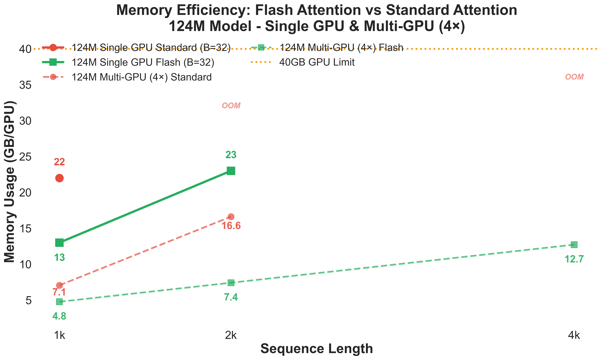
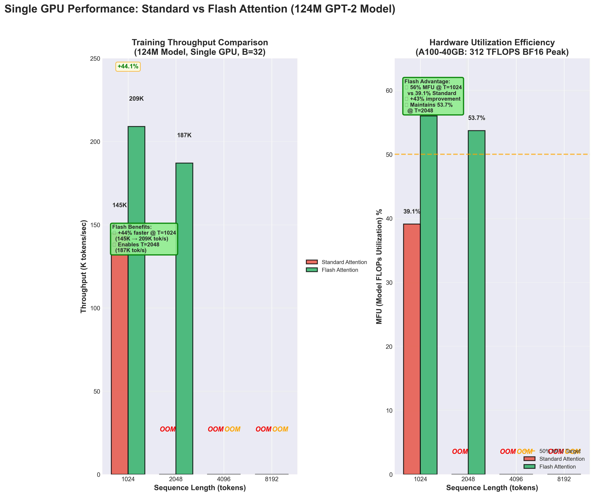
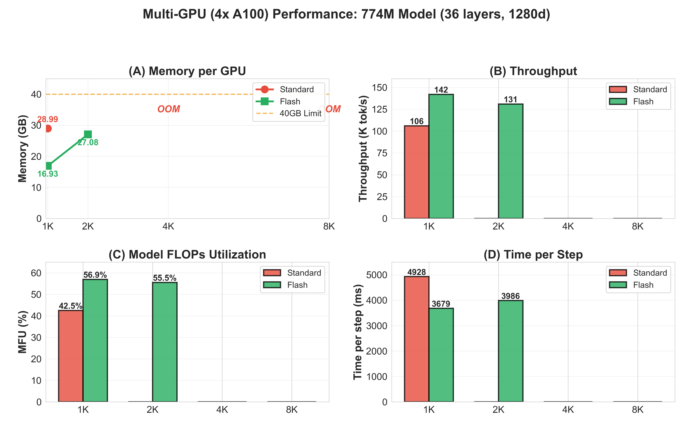
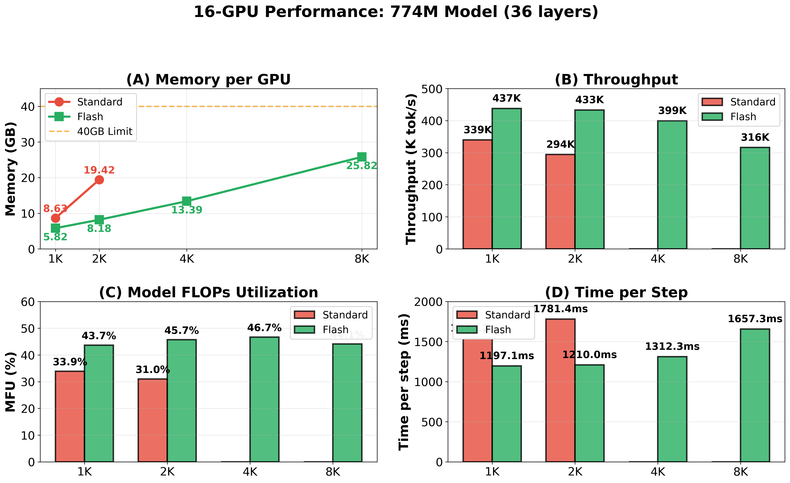
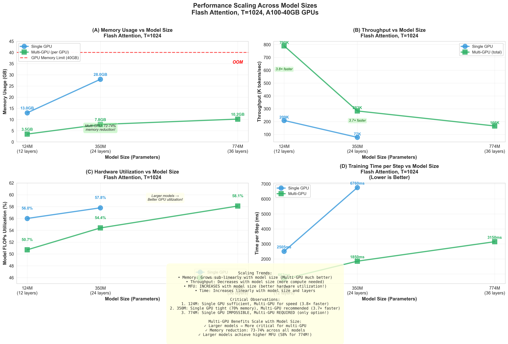
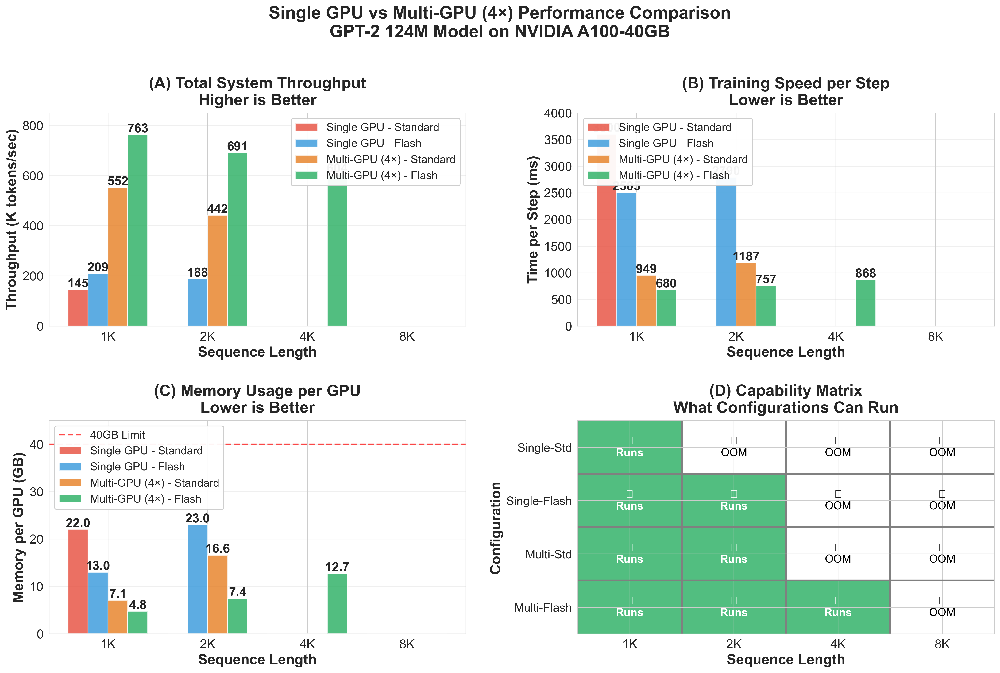

# Flash Attention for GPT-2 Training on HPC

Benchmarking **cuDNN Flash Attention vs Standard Attention** for GPT-2 pre-training across 1–16 NVIDIA A100 GPUs on [NERSC Perlmutter](https://docs.nersc.gov/systems/perlmutter/).

Built on [llm.c](https://github.com/karpathy/llm.c) by Andrej Karpathy, which includes cuDNN Flash Attention support. This project handles the **HPC deployment**: writing a Perlmutter-specific build system and SLURM job scripts, then running systematic benchmarks across model sizes, GPU counts, and sequence lengths.

---

## Key Results

Flash Attention delivers **28–47% higher throughput** and **33–58% less memory per GPU**, and is the **only viable option** for training at 4K–8K sequence lengths on 40 GB GPUs.

### Results by Configuration

> Single GPU experiments used the **124M model** (B=32). Multi-GPU experiments used the **774M model** (B=8 per GPU).

| Setup | Model | Attention | Throughput | Memory/GPU | MFU | Max Seq Len |
|-------|-------|-----------|-----------|------------|-----|-------------|
| 1× A100-40GB | 124M | Standard | 145K tok/s | 22 GB | 39.1% | 1K |
| 1× A100-40GB | 124M | **Flash** | **209K tok/s** | **13 GB** | **56.0%** | **2K** |
| 4× A100-40GB | 774M | Standard | 106K tok/s | 26.4 GB | 42.2% | 1K |
| 4× A100-40GB | 774M | **Flash** | **142K tok/s** | **14.9 GB** | **56.9%** | **2K** |
| 16× A100-40GB | 774M | Standard | 340K tok/s | 8.6 GB | 33.9% | 2K |
| 16× A100-40GB | 774M | **Flash** | **438K tok/s** | **5.8 GB** | **43.7%** | **8K** |

### Sequence Length Capability (16× A100-40GB, 774M Model)

| Sequence Length | Standard | Flash | Flash Memory/GPU |
|----------------|----------|-------|-----------------|
| 1K | 340K tok/s | 438K tok/s (+29%) | 5.8 GB |
| 2K | 294K tok/s | 433K tok/s (+47%) | 8.2 GB |
| 4K | OOM | 399K tok/s | 13.4 GB |
| 8K | OOM | 316K tok/s | 25.8 GB |

> Standard attention OOMs at 4K/8K even with 16-GPU parallelism. Flash Attention extends training to 8K sequences using only 65% of GPU memory.

---

## What This Project Does

Deploys [llm.c](https://github.com/karpathy/llm.c) on NERSC Perlmutter and systematically benchmarks **cuDNN Flash Attention vs standard attention** across:

- **3 model sizes:** GPT-2 124M, 350M, 774M parameters
- **3 GPU tiers:** 1 GPU, 4 GPUs (single node), 16 GPUs (4 nodes, multi-node)
- **4 sequence lengths:** 1K, 2K, 4K, 8K tokens
- **2 attention implementations:** Standard (cuBLAS + custom softmax) vs Flash (cuDNN SDPA)

### What Was Built for This Project

**`src/Makefile.perlmutter`** — Perlmutter-specific build system. Karpathy's original Makefile detects NCCL via `dpkg` and MPI via a hardcoded OpenMPI path — both fail on Perlmutter, which uses a module-based NCCL (`$NCCL_DIR`) and Cray MPICH (`$MPICH_DIR` + GTL). This Makefile handles all 6 training configurations via flags:

```bash
# Single GPU, standard attention
make -f Makefile.perlmutter train_gpt2cu NO_MULTI_GPU=1 NO_USE_MPI=1

# Single GPU, Flash Attention
make -f Makefile.perlmutter train_gpt2cu NO_MULTI_GPU=1 NO_USE_MPI=1 USE_CUDNN=1

# Multi-GPU / multi-node, Flash Attention
make -f Makefile.perlmutter train_gpt2cu USE_CUDNN=1
```

**6 SLURM job scripts** in `scripts/` — covering all experiment configurations with correct Cray MPICH, NCCL, GTL, and cuDNN environment setup for Perlmutter's Slingshot-11 interconnect.

### Data

Training uses the [FineWeb 10B](https://huggingface.co/datasets/HuggingFaceFW/fineweb) dataset. Download and tokenize it with:

```bash
pip install -r requirements.txt
cd src/
python dev/data/fineweb.py -t classic -v 10B
# outputs to src/dev/data/fineweb10B/fineweb_train_*.bin and fineweb_val_*.bin
```

### How Flash Attention Works in llm.c

Flash Attention is already implemented in llm.c via [`src/llmc/cudnn_att.cpp`](src/llmc/cudnn_att.cpp) — a cuDNN frontend graph-based wrapper supporting BF16/FP16, causal masking, and graph caching. It is toggled at compile time with `USE_CUDNN=1`.

---

## Results

### Memory Efficiency

Flash Attention memory scales as **O(T^1.5)** rather than O(T²), enabling practical long-context training:



### Single GPU: Flash vs Standard (124M Model)



### Multi-GPU Scaling (774M Model, 4× A100)



### 16-GPU Results (774M Model, 4 Nodes)



### Throughput vs Model Size



### Scaling from Single to Multi-GPU



See [`results/SINGLE_GPU_RESULTS.md`](results/SINGLE_GPU_RESULTS.md) and [`results/MULTI_GPU_RESULTS.md`](results/MULTI_GPU_RESULTS.md) for full tables.

---

## Multi-GPU Scaling

Scaling from 4 GPUs to 16 GPUs (774M model, Flash Attention, 1K sequences):

| Configuration | Throughput | Time/Step | Memory/GPU | Scaling Efficiency |
|--------------|------------|-----------|------------|--------------------|
| 4× A100-40GB | 142K tok/s | 3,680 ms | 16.9 GB | — |
| 16× A100-40GB | 438K tok/s | 1,197 ms | 5.8 GB | **77%** (3.08× speedup) |

16-GPU runs use 4 nodes connected via **Slingshot-11 interconnect** (~200 Gbps inter-node, NVLink intra-node). Communication overhead is ~12–15% per step.

---

## Hardware

**Platform:** [NERSC Perlmutter](https://docs.nersc.gov/systems/perlmutter/) Supercomputer

| Component | Spec |
|-----------|------|
| GPU | NVIDIA A100-SXM4-40GB (Ampere, SM 8.0) |
| CPU | AMD EPYC 7763 (64 cores) |
| GPU Memory | 40 GB HBM2e |
| Intra-node interconnect | NVLink (600 GB/s) |
| Inter-node interconnect | Slingshot-11 (~200 Gbps) |
| CUDA | 12.4 |
| cuDNN | 9.0+ |
| NCCL | 2.24.3 |
| MPI | Cray MPICH 8.1.30 |

---

## How to Build and Run

### Prerequisites

```bash
# cuDNN 9.0+ (for Flash Attention)
sudo apt-get install libcudnn9-dev-cuda-12

# cuDNN frontend (header-only)
git clone https://github.com/NVIDIA/cudnn-frontend
```

### Build

```bash
cd src/

# Standard attention
make train_gpt2cu

# Flash Attention via cuDNN
make train_gpt2cu USE_CUDNN=1 CUDNN_FRONTEND_PATH=/path/to/cudnn-frontend/include
```

### Single GPU Training

```bash
# Standard attention
./train_gpt2cu -b 32 -t 1024 -d 524288 -e "d12"

# Flash Attention
make train_gpt2cu USE_CUDNN=1
./train_gpt2cu -b 32 -t 1024 -d 524288 -e "d12"
```

### Multi-GPU Training (SLURM)

```bash
# 4 GPUs, standard attention
sbatch scripts/multi_gpu_standard.sh

# 16 GPUs (4 nodes), Flash Attention
sbatch scripts/multi_gpu_flash.sh
```

See [`scripts/`](scripts/) for the full SLURM job scripts used on Perlmutter.

---

## Repo Structure

```
.
├── requirements.txt              # Python dependencies (llm.c)
├── src/                          # llm.c source (unmodified from Karpathy's original)
│   ├── dev/data/                 # Data download scripts (fineweb.py, fineweb.sh, etc.)
│   ├── llmc/
│   │   ├── cudnn_att.cpp         # Flash Attention via cuDNN frontend (llm.c)
│   │   ├── cudnn_att.h
│   │   ├── attention.cuh         # Standard attention baseline (llm.c)
│   │   └── [other llm.c headers]
│   ├── dev/cuda/
│   │   ├── attention_forward.cu  # 11 attention kernel implementations (llm.c)
│   │   ├── attention_backward.cu
│   │   └── softmax_forward.cu
│   ├── train_gpt2.cu             # Main CUDA training binary (llm.c)
│   ├── Makefile                  # Original llm.c Makefile
│   └── Makefile.perlmutter       # ★ Perlmutter-specific build system (this project)
├── scripts/                      # ★ SLURM job scripts for Perlmutter (this project)
│   ├── single_gpu_standard.sh
│   ├── single_gpu_flash.sh
│   ├── multi_gpu_standard.sh
│   ├── multi_gpu_flash.sh
│   ├── multi_node_standard.sh
│   ├── multi_node_flash.sh
│   └── multi_node/               # Multi-node init methods (TCP, filesystem)
├── results/
│   ├── figures/                # Benchmark graphs
│   ├── logs/                   # Representative SLURM job outputs
│   ├── SINGLE_GPU_RESULTS.md
│   └── MULTI_GPU_RESULTS.md
├── analysis/
│   └── analyze_training_logs.py  # Parses SLURM logs to extract metrics
└── report/
    └── CSCE654_Final_Project_Report_Super_Computing.pdf
```

---

## Report

Full write-up: [`report/CSCE654_Final_Project_Report_Super_Computing.pdf`](report/CSCE654_Final_Project_Report_Super_Computing.pdf)

---

## Attribution

Built on [llm.c](https://github.com/karpathy/llm.c) by Andrej Karpathy (MIT License). The `src/` directory contains llm.c source files unmodified, including the cuDNN Flash Attention implementation (`cudnn_att.cpp`), data download scripts (`src/dev/data/`), and `requirements.txt`. Original contributions in this repo are `Makefile.perlmutter`, the SLURM scripts in `scripts/`, and all benchmarking results and analysis.
